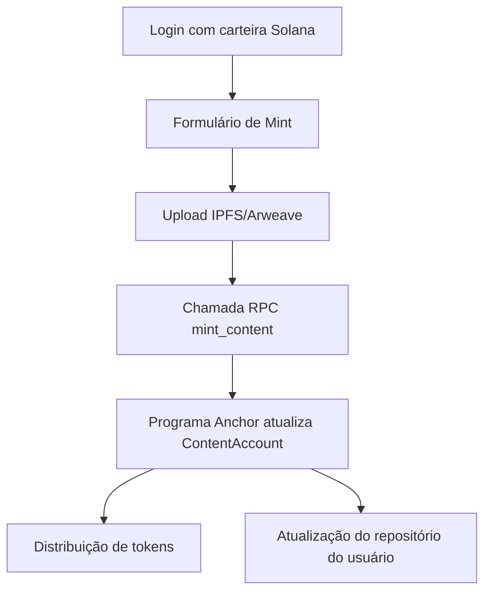

# Arquitetura Virtualia

Virtualia combina uma aplicação web React com um programa Anchor na Solana para mintagem e catalogação de produções acadêmicas.

## Visão geral

1. **Usuário conecta a carteira** (Phantom, Solflare etc.) via `@solana/wallet-adapter` no frontend.
2. **Upload e metadados** são preenchidos pelo usuário. Nesta fase o arquivo (PDF, imagem, vídeo) deve ser armazenado em um serviço descentralizado (IPFS, Arweave) ou temporariamente em um storage centralizado.
3. **Mint**: o frontend chama uma função RPC no programa Anchor passando:
   - URI do arquivo
   - Tipo do conteúdo (artigo, resenha, certificado…)
   - Pontuação de reputação desejada
4. **Programa Anchor** registra o conteúdo no `ContentAccount` e transfere uma recompensa simbólica em tokens SPL (ver `distribute_reward`).
5. **Frontend** atualiza o repositório do usuário e exibe a entrada no CV on-chain.

## Componentes

### Frontend (React + Vite)

- `App.tsx`: configura o provedor Solana, rotas e layout principal.
- `components/WalletConnection.tsx`: botão de conexão/desconexão.
- `components/MintForm.tsx`: formulário de mintagem e upload.
- `components/MintedItemList.tsx`: renderiza os conteúdos on-chain (mock local nesta fase).
- `services/solana.ts`: wraps de chamadas RPC e utilidades Web3.

### Backend / On-chain

- `contracts/Anchor.toml`: configuração Anchor.
- `contracts/programs/virtualia/src/lib.rs`: programa principal, com instruções `initialize_user`, `mint_content` e `distribute_reward`.
- `contracts/tests/virtualia.ts`: teste de integração demonstrando o fluxo básico.

### Futuras extensões

- **Storage descentralizado**: integrar com Bundlr + Arweave ou NFT.Storage para persistir PDFs/Imagens/Vídeos.
- **Indexação**: utilizar Solana RPC customizado + indexer (Helius, Triton) para listar os conteúdos sem precisar de um backend tradicional.
- **Governança**: permitir que a comunidade dê curadoria e avalie conteúdos, ajustando reputação on-chain.

## Fluxo de dados

## Considerações de segurança

- Valide o tipo e tamanho dos arquivos no frontend antes do upload.
- Limite a frequência de mintagem para evitar spam (rate limiting on-chain usando contadores).
- Utilize tokens SPL com supply controlado para recompensas.
- Audite o programa Anchor para evitar vulnerabilidades (overflow, account spoofing, etc.).
